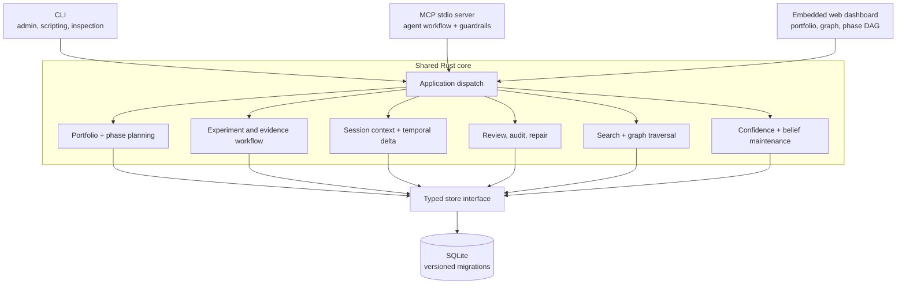

# Project Manager (`pm`)

**A local-first research operations system for execution, evidence, decisions, and continuity across long-running human and agent work.**

`pm` manages projects that outlive a single task list, chat session, agent, or original plan. It coordinates the complete working loop: a portfolio of projects and subprojects, dependency-aware phases, experiments, findings, hypotheses, decisions, literature, constraints, principles, review, and handoff.

Instead of relying on an agent to remember why work exists or what should happen next, `pm` computes actionable phases, preserves the evidence behind decisions, reconstructs active context at session start, and audits the research record for stalled work, unsupported conclusions, contradictory evidence, orphaned nodes, expired constraints, dangling branches, and cross-project leakage.

> **The knowledge graph is central, but it is the substrate—not the whole product.** It gives planning, execution, evidence, belief revision, retrieval, review, and cross-session continuity one coherent state model.

```text
prioritize -> investigate -> capture evidence -> revise beliefs -> decide
     ^                                                        |
     |--------- recover context <- review and redirect <------|
```

**Status:** the current package is pre-1.0 (`0.1.0`). The SQLite store, CLI, MCP server, web dashboard, execution DAG, causal graph, session tooling, retrieval, and integrity surfaces described below are implemented; command, tool, and schema compatibility may still change before 1.0.

## What `pm` provides

| Capability | Implemented behavior |
|---|---|
| **Portfolio control** | Active, paused, and archived projects; aliases; nested subprojects; cross-project priority views. |
| **Executable planning** | Impact-ranked phases, explicit dependencies, topological ordering, actionable-phase selection, completion timestamps, and phase scaffolding. |
| **Experimental workflow** | Experiments with pass/fail/inconclusive outcomes, findings, testable hypotheses, result rollups, and consecutive-failure stagnation detection. |
| **Causal traceability** | Guided MCP workflows require upstream evidence for decisions, follow-on experiments, and principles, then create the corresponding typed relationships automatically. |
| **Research state** | Literature lifecycles, research notes, principles, constraints, feedback, confidence, and belief status live beside execution state rather than in detached documents. |
| **Session continuity** | Session start/end records, an active experiment, temporal deltas, session briefings, phase-local context reconstruction, and compact handoff output. |
| **Retrieval** | Project-scoped text search, composite ranking, topic briefs grouped by node type, one-hop expansion, and phase-centered multi-hop subgraphs. |
| **Review and recovery** | Project review, structural health scoring, causal-chain audits, orphan repair proposals, branch/merge analysis, stale-work warnings, and expired-constraint checks. |
| **Human and agent interfaces** | A Rust CLI, a 37-tool MCP stdio server, and an embedded browser dashboard backed by the same versioned SQLite store. |

## Why this is not a conventional project tracker

A task tracker can say that an item is open or complete. It usually cannot answer:

- What observation caused this experiment to exist?
- Which findings support or contradict the current hypothesis?
- Why was a decision made, and which evidence informed it?
- Which branch of an investigation is unresolved or dangling?
- Which constraint was valid when an experiment ran, and has it since expired?
- What changed since the previous session?
- Which active phase is dependency-unblocked and highest impact now?
- Is the apparent project history causally coherent, or merely chronological?

`pm` treats those questions as operational state. Planning objects, evidence objects, and their relationships are stored together, so the system can compute next actions and reconstruct context rather than asking the user or agent to narrate the project from memory.

## The operating model

A typical `pm`-managed project moves through seven recurring operations:

1. **Orient.** `pm session-init` or `pm_session_context` assembles active phases, pending experiments, recent findings, hypotheses, decisions, literature, constraints, and stale-work warnings.
2. **Prioritize.** The DAG engine filters out blocked or resolved phases and ranks the remaining work by impact. Portfolio dashboards apply the same logic across projects and subprojects.
3. **Investigate.** Work is represented as explicit experiments inside phases. In the guided MCP workflow, every follow-on experiment must identify the finding, decision, or prior experiment that motivated it.
4. **Capture evidence.** Findings are attached to experiments, related findings are surfaced, potential contradiction candidates are reported, and causal edges are created where the relationship is known.
5. **Interpret.** Evidence can test hypotheses, inform decisions, establish principles, update literature status, or validate constraints. Decisions retain both `what` and `why`.
6. **Review and redirect.** Review and audit commands expose stagnation, unsupported decisions, untested hypotheses, unused literature, orphans, expired constraints, broken branches, temporal inconsistencies, and graph-structure weaknesses.
7. **Hand off.** Sessions record an active experiment and summary; `pm_since`, session context, and handoff output make the next session resume from state rather than from conversational recollection.

This loop is deliberately iterative. Failed and inconclusive experiments remain evidence. The MCP decision workflow includes a cleanup guard that warns when closure or pruning language may discard a useful negative result instead of redirecting the investigation.

## Core capabilities

### Portfolio and dependency-aware execution

Projects can be standalone or nested under parent projects. Each project has a lifecycle (`Active`, `Paused`, `Archived`) and an optional alias. The CLI and browser UI expose the hierarchy; dashboard operations aggregate active work across the portfolio.

Phases are executable containers rather than headings. A phase can carry:

- an impact score;
- dependencies on other phases;
- description, goals, and success criteria;
- pending, in-progress, complete, deprioritized, or paused status;
- start and completion timestamps.

`DagEngine` provides topological ordering, dependency-satisfied phase selection, impact ranking, and stagnation detection over recent failed or inconclusive experiments. `pm next` reports the highest-value actionable work. `pm scaffold` converts pending experiments in a phase into text or JSON task payloads; the MCP form emits task-oriented output suitable for an agent loop.

The opinionated MCP phase update path also enforces a completion gate: a phase cannot be marked complete while it still contains pending experiments.

### Experiments, findings, and causal decisions

The core execution chain is:

```text
Project -> Phase -> Experiment -> Finding -> Decision
                     ^              |
                     |              +-> Hypothesis
                     +------------------ Decision / prior Experiment / Finding
```

The graph permits richer relationships, but this causal backbone is the default discipline encoded by the MCP tools:

- The first experiment in a phase may be a root investigation.
- Later experiments must identify an upstream finding, decision, or experiment.
- Findings normally attach to the experiment that produced them; a current session's active experiment can supply the association when an explicit ID is omitted.
- Decisions are rejected unless they identify an informing experiment or one or more findings.
- Principles are rejected unless they derive from a finding or decision.
- Completing an experiment can create its finding in the same operation and reports the phase's remaining experiment state.

When one experiment produces multiple downstream experiments, `pm` identifies the fan-out as a branch point and records `BranchesFrom` relationships. When a decision converges findings from multiple experiments, it records a merge point with `ConvergesInto` relationships. Reviews later report unresolved branches and convergence topology.

The lower-level CLI remains useful for administration and scripting, but the MCP tools are the stricter agent workflow surface: they add validation, causal requirements, lifecycle gates, automatic relationships, and contextual guidance before or after writes.

### Hypothesis and literature lifecycles

Hypotheses carry a proposed/testing/confirmed/refuted lifecycle, plus optional prediction, evaluation criteria, experiment, finding, confidence, and belief state.

The guided lifecycle encodes evidence requirements:

- moving from proposed to testing requires an incoming supporting or informing relationship;
- testing can attach the experiment that evaluates the hypothesis;
- confirmation can attach a supporting finding;
- refutation requires a disproving finding and creates a contradiction relationship through the truth-maintenance path.

Literature entries are not inert bookmarks. They can hold authors, venue, year, arXiv ID, URL, code URL, summary, relevance, and key findings, and move through a guarded lifecycle:

```text
unread -> read -> cited/tested/promising -> integrated or dead_end
```

Terminal literature states cannot be advanced arbitrarily. Status changes return suggested relationships to the experiment, finding, or decision that used the source.

### Principles, constraints, research, and feedback

`pm` keeps durable project guidance in the same system as empirical work:

- **Principles** are universal-, project-, or phase-scoped guidance with rationale, enforcement level, confidence, belief status, and supersession/refinement state. The MCP path requires evidence provenance.
- **Constraints** describe hardware, software, or process boundaries with source, severity, resource, measured value, and optional expiry. Active and expired constraints are surfaced when experiments are created and during review.
- **Research entries** hold longer investigations or reflection reports associated with phases and findings.
- **Feedback entries** record corrections and confirmations as first-class project history.

This prevents project intent, external evidence, execution results, and learned operating rules from splitting into unrelated documents that an agent must reconcile manually.

### Session continuity and temporal awareness

Sessions are persistent records with project scope, start/end timestamps, summary, and an active experiment. Temporal operations include:

- `pm_session_start` and `pm_session_end`;
- `pm_session_set_experiment` for the current focus;
- `pm_since` to return nodes changed since a timestamp or earlier session;
- `pm_session_init` for a portfolio-wide briefing;
- `pm_session_context` for a project-specific active-phase briefing;
- `pm handoff` for compact terminal-oriented transfer output.

Session context is not a generic dump. The implementation selects the active or highest-impact actionable phase, extracts a bounded phase-centered subgraph, and organizes experiments, findings, hypotheses, decisions, literature, constraints, and next actions around that working set.

### Retrieval and context assembly

`pm` currently uses local SQLite text retrieval rather than an external embedding or vector service. Search results are ranked with a composite of text overlap, graph connectivity, evidence weight, and recency.

The retrieval surfaces serve different purposes:

| Command/tool | Result |
|---|---|
| `pm search` / `pm_search` | Ranked matches, optionally scoped to one project or iterated across active projects. |
| `pm query` / `pm_query` | Top text matches with immediate graph neighbors for quick free-text inspection. |
| `pm context` / `pm_context` | Topic-centric brief grouped by node type, with one-hop relationships and cross-references. |
| `pm_session_context` | Active-phase context assembled from a filtered, multi-hop phase subgraph. |
| `pm_since` | Temporal delta rather than topical retrieval. |
| `pm_kg_traverse` | Direct inspection of incoming and outgoing relationships for one node. |

The graph traversal engine supports bidirectional breadth-first traversal, bounded depth, edge-type inclusion/exclusion, proximity metadata, typed neighborhood queries, and phase-subgraph extraction.

### Review, audit, and repair

The project contains three complementary integrity surfaces rather than one generic “health” command.

**`pm review` / `pm_review`** is the operational review. It reports experiment outcomes, pending work, stagnation, impact-ranked phases, explicit contradictions, literature and hypothesis state, orphans, branch/merge topology, dangling branches, expired constraints, aged unresolved nodes, and suspended or retracted beliefs. Experiments with enough numeric findings also receive a median-absolute-deviation-based result signal.

**`pm kg-audit` / `pm_kg_audit`** calculates a structural health score across:

- causal-chain completeness;
- hypothesis coverage;
- literature utilization;
- edge density;
- temporal coherence;
- cross-project references.

**`pm orphan-repair` / `pm_orphan_repair`** diagnoses concrete repair cases: decisions without causal upstream, projectless decisions, unconnected hypotheses/principles/constraints, research without phases, true zero-edge orphans, cross-project causal bleed, and dangling branches. It returns targeted repair instructions rather than silently mutating the record.

### Truth maintenance and contradiction handling

Findings, decisions, hypotheses, principles, and constraints can carry confidence and a belief status. `Supports` and `Contradicts` relationships created through the MCP edge tool use the truth-maintenance path, report confidence changes, and can suspend affected nodes for explicit review. Operators can then set confidence or belief status directly with `pm_set_confidence` and `pm_set_belief`.

Contradiction handling has two distinct layers:

1. **Authoritative graph state:** an explicit `Contradicts` relationship records a known conflict and participates in truth maintenance and review.
2. **Candidate detection:** logging a finding runs a high-recall heuristic scan over project findings using negation parity, antonym pairs, context-matched numeric divergence, and correction markers. Candidates are surfaced for review; the code can prepare a typed NLI prompt for a second-stage classifier, but it does not silently convert heuristic candidates into asserted contradictions.

This distinction is intentional: retrieval can suggest a conflict, while belief-changing graph updates remain explicit and inspectable.

## Automation boundaries

`pm` combines hard workflow semantics with advisory analysis. They should not be confused.

| Deterministic or enforced | Advisory or heuristic |
|---|---|
| Phase dependency checks and impact ordering | Composite search ranking |
| MCP phase completion gate | Contradiction candidate retrieval |
| Required decision rationale at the database layer | MAD-based experiment result signal |
| MCP causal-upstream requirements | Cleanup/pruning language warning |
| Hypothesis and literature transition checks | Staleness thresholds and next-action wording |
| Typed edge validation and uniqueness | Structural health score and repair proposals |
| Versioned SQLite migrations | Suggested relationships based on textual overlap |

The system is designed to make state and provenance inspectable, not to replace scientific or engineering judgment.

## Current boundaries

- `pm` computes priorities, context, warnings, and repair proposals; it does not autonomously execute research or silently close work.
- Retrieval is lexical and graph-aware rather than embedding-based semantic search.
- Contradiction detection produces candidates and an optional external-classifier prompt; no semantic classifier is invoked by the Rust process.
- The SQLite deployment model is local-first and best suited to a single operator or agent runtime, not concurrent multi-user collaboration.
- MCP transport is stdio-based rather than a network service.
- The browser dashboard is an embedded operational UI, not a hardened public service; it binds to `0.0.0.0`, has no authentication, and loads D3 from a CDN.

## Architecture



The implementation is a Rust binary and library. `main.rs` selects either the clap CLI or the line-delimited JSON-RPC MCP server. The browser UI is served by `warp`; its data comes from the same SQLite-backed store used by the other interfaces.

### Interface responsibilities

| Interface | Best suited for | Important behavior |
|---|---|---|
| **CLI** | Direct administration, shell scripting, inspection, imports, handoffs, and local review. | Broad CRUD surface plus DAG, search, context, review, audit, repair, and dashboard commands. Some direct CLI writes are intentionally lower level than MCP writes. |
| **MCP** | Long-running agent loops and tool-mediated research work. | 37 registered tools, structured validation errors, causal and lifecycle guardrails, automatic relationship creation, session state, and task-oriented responses. |
| **Web** | Human inspection of a portfolio and its structure. | Hierarchical project tree, node counts, ranked search, D3 knowledge graph, phase-DAG view, node details, project status controls, and cross-project priority summary. |

## Quickstart

### Build

`pm` uses bundled SQLite, so it does not require an external database server.

```bash
git clone https://github.com/wahargis/project-manager.git
cd project-manager
cargo build --release

# Optional: install `pm` on PATH with Cargo
cargo install --path .
```

The default database is `~/.local/share/pm/pm.db`. Use the global `--db` option to isolate a project or test run.

### Create and execute a project

```bash
PM=./target/release/pm
DB=/tmp/pm-demo.db

$PM --db "$DB" project activate retrieval-lab --alias rl
$PM --db "$DB" phase retrieval-lab add "Establish retrieval baseline" --impact 80
$PM --db "$DB" phase retrieval-lab add "Evaluate session context" --impact 100 --depends 1
$PM --db "$DB" phase retrieval-lab update 1 --status in_progress

$PM --db "$DB" exp retrieval-lab add \
  "Measure baseline retrieval quality" --phase 1

$PM --db "$DB" finding retrieval-lab add \
  "The baseline retrieves recent observations reliably but loses the causal path from findings to decisions when the session is reconstructed from text alone." \
  --experiment 1

$PM --db "$DB" hyp retrieval-lab add \
  "Phase-centered graph context will preserve causal continuity better than a flat transcript summary" \
  --phase 2 --finding 1

$PM --db "$DB" dec retrieval-lab add \
  "Use phase-centered context as the next retrieval experiment" \
  --why "The baseline finding isolates causal continuity as the failure mode, and phase-scoped traversal is the smallest testable intervention." \
  --experiment 1

$PM --db "$DB" next retrieval-lab
$PM --db "$DB" review retrieval-lab
$PM --db "$DB" context "causal continuity" --limit 5
$PM --db "$DB" handoff retrieval-lab
```

### Inspect the portfolio in a browser

```bash
$PM --db "$DB" serve --port 9090
```

Open `http://localhost:9090`.

> **Network warning:** run the dashboard only on a trusted network or behind appropriate access controls; the current server binds to `0.0.0.0` and has no authentication.

## MCP integration

Start the MCP server over stdio with a database selected through `PM_DB`:

```bash
PM_DB=/tmp/pm-demo.db ./target/release/pm --mcp
```

A typical MCP client configuration is:

```json
{
  "mcpServers": {
    "project-manager": {
      "command": "/absolute/path/to/pm",
      "args": ["--mcp"],
      "env": {
        "PM_DB": "/absolute/path/to/pm.db",
        "PM_WEB_PORT": "9090"
      }
    }
  }
}
```

The server implements line-delimited JSON-RPC over stdio and reports MCP protocol version `2024-11-05`. It also attempts to start the web dashboard; if the requested port is occupied, MCP operation continues without the dashboard.

The 37 tools are grouped around the actual operating loop:

| Tool group | Representative tools |
|---|---|
| Orientation and planning | `pm_dashboard`, `pm_next`, `pm_scaffold`, `pm_session_init`, `pm_session_context` |
| Evidence workflow | `pm_experiment_create`, `pm_exp_complete`, `pm_log_finding`, `pm_decision` |
| Research state | `pm_hyp_add`, `pm_hyp_update`, `pm_lit_add`, `pm_lit_status`, `pm_constraint_add`, `pm_principle_add`, `pm_research_complete` |
| Retrieval and graph | `pm_search`, `pm_query`, `pm_context`, `pm_kg_traverse`, `pm_add_edge` |
| Review and integrity | `pm_review`, `pm_orphan_repair`, `pm_kg_audit`, `pm_stats` |
| Portfolio and sessions | `pm_project_create`, `pm_project_list`, project status tools, `pm_session_start`, `pm_session_set_experiment`, `pm_since`, `pm_session_end` |
| Belief maintenance | `pm_set_confidence`, `pm_set_belief` |

`pm_research_step` remains registered as a compatibility path but now refuses implicit finding auto-routing and directs callers to create an explicit experiment and then log the finding. That behavior reflects the current design commitment: preserving causal provenance is more important than saving one tool call.

## Browser dashboard

The embedded dashboard provides two coordinated visualizations:

- **Knowledge Graph:** typed nodes and relationships, subproject hulls, project hierarchy, node detail tooltips, search-result focus, and edge semantics.
- **Phase DAG:** phase state, dependencies, impact, and project-level execution structure.

The sidebar includes hierarchical project navigation, node counts, archived-project handling, status controls, ranked cross-node search, and a portfolio dashboard of next actionable phases.

The HTTP surface exposes JSON endpoints for projects, graph data, phases, experiments, findings, decisions, research, principles, hypotheses, constraints, literature, feedback, search, and dashboard data. It is presently an embedded operational UI, not a hardened multi-user service.

## Data model

The store separates execution state, evidence, durable guidance, and continuity while allowing typed relationships between them.

| Group | Objects |
|---|---|
| **Portfolio and execution** | `Project`, `Phase`, `Experiment` |
| **Evidence and interpretation** | `Finding`, `Hypothesis`, `Decision` |
| **Research context and policy** | `LiteratureEntry`, `Research`, `Principle`, `Constraint`, `FeedbackEntry` |
| **Continuity** | `Session`, temporal deltas, staleness reports |

<details>
<summary>Node lifecycle and metadata</summary>

- `Project`: active/paused/archived, alias, optional parent.
- `Phase`: pending/in-progress/complete/deprioritized/paused, impact, dependencies, description, goals, success criteria, timestamps.
- `Experiment`: pending/pass/fail/inconclusive, phase, hypothesis, result, notes.
- `Finding`: experiment, text, confidence, belief status.
- `Decision`: project/experiment, what, required why, confidence, belief status.
- `Hypothesis`: proposed/testing/confirmed/refuted, prediction, criteria, experiment, finding, confidence, belief status.
- `Principle`: universal/project/phase scope, active/superseded/refined, rationale, enforcement level, provenance, confidence, belief status.
- `Constraint`: hardware/software/process scope, source, severity, resource, measured value, expiry, confidence, belief status.
- `LiteratureEntry`: citation metadata, source and code links, relevance, key findings, summary, lifecycle status.
- `Research`: phase-scoped investigation/report with pending/in-progress/complete state.
- `FeedbackEntry`: correction or confirmation.
- `Session`: project, start/end, summary, active experiment.

Project-scoped records receive compact per-project ordinal references such as `F#12`, `E#7`, and `D#4`, while global SQLite IDs remain available internally.

</details>

<details>
<summary>Relationship vocabulary</summary>

`ProducedBy`, `Informed`, `Supports`, `Contradicts`, `Supersedes`, `DependsOn`, `RelatedTo`, `CitedIn`, `Contains`, `DerivedFrom`, `TestedBy`, `ViolatedBy`, `BranchesFrom`, and `ConvergesInto`.

Relationships are unique by source, target, and relation. Traversal can inspect both directions and can filter by relationship type.

</details>

## Persistence, migration, and import

- One SQLite database is the source of truth.
- `rusqlite` is built with bundled SQLite.
- Schema changes are applied through sequential, idempotent, transaction-wrapped migrations.
- The current migration chain covers phase containers, decision provenance, literature metadata, hypothesis lifecycle, constraint and principle metadata, unique relationships, subprojects, per-project ordinals, temporal sessions, confidence/belief state, active session experiments, and completion timestamps.
- `pm import <project.json> --name <project>` imports the repository's v2 JSON shape for phases, experiments, findings, and decisions.

Because the state is a normal SQLite file, it is straightforward to back up, inspect, copy, or isolate per environment.

## CLI command map

```text
pm project ...       project lifecycle and hierarchy
pm phase ...         phase DAG and lifecycle
pm exp ...           experiment CRUD and outcomes
pm finding ...       findings and local traversal
pm dec ...           decisions and rationale
pm hyp ...           hypothesis lifecycle
pm lit ...           literature lifecycle
pm principle ...     durable guidance
pm con ...           constraints
pm research ...      research reports
pm fb ...            corrections and confirmations
pm kg ...            relationship inspection and mutation

pm dashboard         cross-project execution view
pm next <project>    dependency-unblocked, impact-ranked phases
pm scaffold ...      pending experiments as task payloads
pm session-init      active portfolio briefing
pm context ...       topic-centric context brief
pm query ...         top matches plus neighbors
pm search ...        ranked text retrieval
pm review ...        operational integrity review
pm orphan-repair ... structural diagnosis and repair proposals
pm kg-audit ...      structural health score
pm handoff ...       compact session transfer
pm serve ...         embedded browser dashboard
pm import ...        v2 JSON import
```

Run `pm --help` or `pm <command> --help` for the complete clap-generated interface.

## Development

A Rust toolchain with edition 2024 support is required.

```bash
cargo build
cargo test
cargo clippy -- -D warnings
cargo fmt -- --check

# Equivalent repository checks
make check
```

The test suite covers the SQLite store and migrations, DAG behavior, graph traversal, confidence extraction, contradiction signals, validation, MCP tools, session context, review, and integrity workflows.

## Repository layout

| Path | Responsibility |
|---|---|
| `src/store/` | Typed persistence API, SQLite implementation, migrations, search, temporal state, and truth-maintenance operations. |
| `src/dag/` | Topological ordering, actionable-phase selection, and stagnation detection. |
| `src/kg/` | Typed graph traversal, neighborhoods, phase subgraphs, and explicit contradiction traversal. |
| `src/analysis/` | Numeric result signals and contradiction-candidate analysis. |
| `src/mcp/` | JSON-RPC server, 37 tool schemas, guided node/edge workflows, dashboards, context, review, audit, and repair. |
| `src/cli/`, `src/cli_runner.rs` | clap interface and direct command handlers. |
| `src/web.rs`, `src/web/index.html` | Embedded HTTP API and D3 dashboard. |
| `docs/` | Architecture, quickstart, MCP, knowledge-model, roadmap, and reference material. |
| `v2-reference/` | Historical v2 data and import reference. |

## Further documentation

- [Architecture](docs/architecture.md)
- [Knowledge model](docs/knowledge-model.md)
- [Quickstart](docs/quickstart.md)
- [MCP server](docs/mcp.md)
- [Roadmap](docs/roadmap.md)
- [Reference notes](docs/reference/README.md)

## License

Licensed under the [MIT License](LICENSE).
