# project-manager

**Repository:** <https://github.com/wahargis/project-manager>

`pm` is a research project manager for long-running agentic projects. It gives an agent (or a human) a durable, queryable memory of what has been tried, what is believed, what contradicts what, and what should happen next — across many sessions and many thousands of knowledge-graph nodes.

## Problem statement

Long-running agentic work does not fit a task list. An agent that runs for days or weeks across sessions produces hundreds of findings, experiments, decisions, hypotheses, constraints, and literature notes. Without a structured substrate, that record drifts:

- sessions restart with no orientation and no handoff;
- contradictory findings coexist without being detected;
- findings become orphaned from the experiments and decisions that produced them;
- phases stall without a computed next action;
- decisions lose the reasoning that motivated them.

`pm` addresses this by making research state a small, typed knowledge graph:

- **Phases form a DAG with impact scores**, so the next action is computed from dependencies and impact, not remembered.
- **Evidence objects carry truth-maintenance state.** Findings, decisions, hypotheses, principles, and constraints have `confidence` and `belief_status`, and adding a `Supports` or `Contradicts` edge updates the graph accordingly — including suspension of contradicted nodes and their downstream dependents.
- **Decisions are causal.** The database requires a non-empty `why` for every decision, and MCP-level enforcement asks experiments and decisions to link to their upstream cause.
- **One store, three frontends.** The same Rust core serves the `pm` CLI, an MCP stdio JSON-RPC server, and an embedded web dashboard.

## Architecture



The same domain core sits behind three frontends:

| Frontend | Entry point | Purpose |
|---|---|---|
| CLI | `pm` | Fast, scriptable project management from a terminal. |
| MCP server | `pm --mcp` | JSON-RPC over stdio; exposes 37 tools so an MCP client can read and write project state directly. |
| Web dashboard | `pm serve` | Embedded warp dashboard on port 9090; also auto-starts with `pm --mcp` unless the port is busy or `PM_WEB_PORT` is set. |

Persistence is a single SQLite database managed through `rusqlite` with bundled SQLite and versioned schema migrations.

## Knowledge-object model

### Node types

| Node type | Meaning | State carried |
|---|---|---|
| `Project` | Top-level research effort. | Active / Paused / Archived; optional parent project and alias. |
| `Phase` | Unit of execution inside a project. | Pending / InProgress / Complete / Deprioritized / Paused; `impact` score and `depends_on` DAG edges. |
| `Experiment` | A concrete investigation under a phase. | Pending / Pass / Fail / Inconclusive; optional hypothesis, result, and notes. |
| `Finding` | Empirical observation, normally linked to an experiment. | `confidence`, `belief_status`. |
| `Decision` | A recorded choice with mandatory rationale. | `confidence`, `belief_status`; non-empty `why` enforced by a database trigger. |
| `Hypothesis` | A testable prediction. | Proposed / Testing / Confirmed / Refuted lifecycle; optional prediction and evaluation criteria. |
| `Principle` | Project-level guidance or policy. | Universal / Project / Phase scope; Active / Superseded / Refined. |
| `Constraint` | A hard boundary. | Hardware / Software / Process scope; severity, measured value, expiry. |
| `Research` | A longer research or reflection note. | Pending / InProgress / Complete. |
| `LiteratureEntry` | A citation or reference. | arXiv ID or URL, venue, year, key findings, reading status. |
| `FeedbackEntry` | A correction or confirmation. | Correction / Confirmation category. |
| `Session` | Cross-session continuity record. | Start/end timestamps, summary, active experiment. |

### Edge types

The graph is a polymorphic edge table — any node type can connect to any other through one of these relations:

`ProducedBy`, `Informed`, `Supports`, `Contradicts`, `Supersedes`, `DependsOn`, `RelatedTo`, `CitedIn`, `Contains`, `DerivedFrom`, `TestedBy`, `ViolatedBy`, `BranchesFrom`, `ConvergesInto`.

### Truth maintenance and retrieval

- **Truth maintenance.** Adding a `Supports` edge raises the target's confidence; adding a `Contradicts` edge lowers confidence and can suspend the contradicted node plus its downstream dependents (JTMS-style).
- **DAG execution.** `DagEngine` provides topological sort, impact-sorted next-phase selection, and consecutive-failure stagnation detection.
- **Graph analysis.** The knowledge-graph engine does bidirectional traversal, graph-based contradiction detection with heuristic scoring, orphan detection across node types, and structural health audits.
- **Search and context.** `pm search`, `pm context`, and `pm query` run SQLite text search with a composite score (text match + edge count + evidence weight + recency bonus). `pm context` groups results by node type and adds one-hop neighbor expansion.

## CLI usage

All examples assume `pm` is on `PATH` (for example after `cargo install --path .`). If you are running from a checkout, replace `pm` with `./target/release/pm` after `cargo build --release`.

Create a synthetic project and give it a DAG of phases:

```bash
pm --db /tmp/atlas.db project activate atlas --alias at
pm --db /tmp/atlas.db phase atlas add "Map retrieval gaps" --impact 40
pm --db /tmp/atlas.db phase atlas add "Test topic briefings" --impact 80
pm --db /tmp/atlas.db phase atlas add "Package handoff" --impact 60 --depends 1

pm --db /tmp/atlas.db next atlas
# === Next Phases (by impact) ===
#   NEXT #2 [impact:80] Test topic briefings
#   NEXT #1 [impact:40] Map retrieval gaps
```

Record evidence, a hypothesis, and a causal decision:

```bash
pm --db /tmp/atlas.db exp atlas add "Survey retrieval evaluation practice" \
  --phase 1 --status pass \
  --result "Precision metrics dominate public benchmarks; recall-oriented context retrieval is rarely evaluated."

pm --db /tmp/atlas.db finding atlas add \
  "A survey of retrieval evaluation practice shows precision-oriented metrics such as BLEU and METEOR dominate public benchmarks, while recall-oriented context retrieval is rarely evaluated in long-running agentic work. This suggests topic-scoped briefings should be tested as a lightweight recall surface before investing in heavier embedding pipelines." \
  --experiment 1

pm --db /tmp/atlas.db hyp atlas add "Topic-scoped briefings improve next-action selection" \
  --phase 2 --finding 1
# Hypothesis #1 added ... Auto-edge: Finding#1 --Supports--> Hypothesis#1

pm --db /tmp/atlas.db dec atlas add "Adopt topic-scoped context briefings as the primary retrieval primitive" \
  --why "The survey finding shows recall-oriented retrieval is underserved, and a CLI/MCP-callable topic briefing is cheap to ship, testable in the active phase, and directly supports session start."
```

Query the graph the way an agent would during a session:

```bash
pm --db /tmp/atlas.db search atlas retrieval
pm --db /tmp/atlas.db context "retrieval evaluation" --limit 4
pm --db /tmp/atlas.db session-init
pm --db /tmp/atlas.db review atlas
pm --db /tmp/atlas.db handoff atlas
```

Representative `pm context` output:

```text
=== Context: "retrieval evaluation" ===

## Finding (1)
  F#1 [score=1.30]: A survey of retrieval evaluation practice shows precision-oriented metrics such as BLEU and METEOR dominate public bench
    Neighbors: ->Supports H#1

## Decision (1)
  D#1 [score=0.80]: Adopt topic-scoped context briefings as the primary retrieval primitive

## Experiment (1)
  E#1 [score=1.30]: Survey retrieval evaluation practice

## Phase (1)
  Ph#1 [score=0.80]: Map retrieval gaps

Summary: 4 nodes across 4 types.
```

Other useful commands: `pm dashboard`, `pm stats atlas`, `pm scaffold atlas --phase 2`, `pm kg atlas map`, `pm kg atlas edge finding 1 hypothesis 1 supports`, `pm orphan-repair atlas`, `pm kg-audit atlas`, and `pm import <file.json> --name <project>` for v2 JSON imports.

## MCP usage

Start the MCP server over stdio. The server reads one JSON-RPC message per line and writes one JSON-RPC response per line:

```bash
PM_DB=/tmp/atlas.db pm --mcp
```

Initialize and list tools:

```bash
printf '%s\n' \
  '{"jsonrpc":"2.0","id":1,"method":"initialize","params":{"protocolVersion":"2024-11-05","capabilities":{},"clientInfo":{"name":"reviewer","version":"1.0"}}}' \
  '{"jsonrpc":"2.0","id":2,"method":"tools/list"}' \
| PM_DB=/tmp/atlas.db pm --mcp
```

Call a tool directly:

```bash
printf '%s\n' \
  '{"jsonrpc":"2.0","id":3,"method":"tools/call","params":{"name":"pm_session_init","arguments":{}}}' \
| PM_DB=/tmp/atlas.db pm --mcp
```

The response includes a `content` array with the session briefing as text — active phases, pending experiments, untested hypotheses, and a knowledge briefing for each active project.

The 37 registered MCP tools include project and phase management, experiment and finding logging, hypothesis and constraint lifecycle, knowledge-graph edges and traversal, search/context/query retrieval, review and orphan repair, and session tools such as `pm_session_init`, `pm_session_context`, `pm_since`, `pm_session_start`, and `pm_session_end`.

## Synthetic end-to-end workflow

The `atlas` project above is a complete miniature run:

1. **Orient.** `pm session-init` computes the highest-impact actionable phases and prints the knowledge briefing, so the agent starts with context instead of empty memory.
2. **Execute.** The agent works the top phase (`Test topic briefings`), creating experiments and logging findings as it goes.
3. **Maintain the graph.** A finding that supports a hypothesis creates an automatic `Supports` edge; contradictory evidence is added with a `Contradicts` edge or is surfaced by `pm review` and `pm search`.
4. **Decide causally.** Decisions record `what` and `why`, and link back to the experiment or findings that motivated them.
5. **Review and repair.** `pm review` flags stagnation, untested hypotheses, and orphaned nodes; `pm orphan-repair` and `pm kg-audit` propose structural repairs.
6. **Hand off.** `pm handoff atlas` emits a compact session handoff: phases complete, next action, and recent findings.

## Relationship to long-running agentic projects

`pm` is designed for the failure modes of long agentic runs: context loss at session boundaries, belief drift, and undetected contradictions. It complements an agent rather than replacing its reasoning:

- **Session start is explicit.** `pm_session_init` / `pm session-init` and `pm_session_context` orient the agent before work begins.
- **The graph is the memory.** Findings, decisions, and hypotheses persist as typed objects with confidence and belief state, so the agent can be interrupted, resumed, or replaced without losing the research record.
- **Next actions are computed, not remembered.** The DAG engine selects dependency-satisfied, impact-sorted phases and detects stagnation, so a long project keeps moving even when the original plan is stale.
- **Truth maintenance keeps the graph honest.** `Supports` and `Contradicts` edges propagate confidence changes and suspend contradicted subtrees instead of leaving conflicting beliefs live.
- **MCP makes it ambient.** Any MCP-capable agent can call the same tools the CLI uses, so project state is available inside the agent loop rather than in a separate terminal.

## Documentation

- [Architecture](docs/architecture.md) — system structure and data flow.
- [Knowledge model](docs/knowledge-model.md) — node types, edge types, truth maintenance, DAG, and graph analysis.
- [Quickstart](docs/quickstart.md) — build, synthetic project, dashboard.
- [MCP server](docs/mcp.md) — agent integration.
- [Roadmap](docs/roadmap.md) — shipped, in progress, and planned.
- [Reference notes](docs/reference/README.md) — historical design and planning documents.

## Repository layout

| Path | Contents |
|---|---|
| `src/cli/` | clap command and subcommand definitions. |
| `src/cli_runner.rs` | CLI command handlers. |
| `src/store/` | SQLite store, versioned migrations, typed node/edge model. |
| `src/dag/` | DAG execution engine. |
| `src/kg/` | Knowledge-graph traversal and contradiction detection primitives. |
| `src/analysis/` | Confidence scoring and contradiction analysis. |
| `src/mcp/` | MCP stdio server and the 37 tool implementations. |
| `src/web.rs`, `src/web/index.html` | Embedded warp dashboard. |
| `docs/` | Design and scope notes. |
| `v2-reference/` | Vendored v2 reference data and import material. |

*GitHub: <https://github.com/wahargis/project-manager>*

## License

Licensed under the [MIT License](LICENSE).
